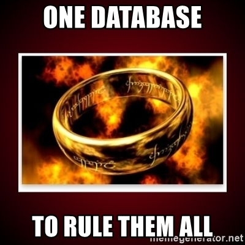

# Constat
J'ai la chance de pratiquer de la modélisation d'objets dans le cadre d'applications variées, utilisant pour la peine un mix entre diagrammes UML et du Design Emergeant en codant directement les classes d'objets au fur et à mesure.

Et toujours se pose la question de : "comment organiser les classes" et surtout "quelles sont leur responsabilités". Et toujours de grands débats animent les séances de coding.

Donnant actuellement des cours UML et conception objet, c'est toujours difficille d'expliquer comment poser les bases d'un "bon" design objet.

L'apprentissage classique et nombre de tutos sur les internets qui ont emboité le pas dans la catégorie "auto formation" se délecte des exemples simplistes et absolument pas en phase avec le quotidien du développeur: le cercle, le carré, le réctangle, la forme géométrique sont les exemples donnés pour un modèles objet. Et on y colle les opérations habituelles: calculer aire ou je ne sais quoi de basique.

Avec cela, beaucoup de développeurs se font une très mauvaise idée de ce que peut être un vrai modèle objet dans une application d'entreprise qui se verra mise en production avec des milliers d'utilisateurs (ou plus j'espère) et des années de durée de vie entrainant une nécessaire maintenance et évolution.
Sans parler des corrections de bugs.

# L'héritage lancinant de Merise

Je trouve que la méthode Merise a causé énormément de tort et de retard à l'ingénierie logicielle en France (pour ce que j'en connais).
Très en vogue dans les années 80, elle est extrêment rigide et s'accorde bien du cycle de développement en V. Elle impose tout un tas de diagrammes que je qualifie sans peur de Big Design Upfront, qui ont tendance à rassurer les chefs de projets et les développeurs quand il faut s'attaquer à développer un système sans trop savoir où cela va nous mener.

La méthode de modélisation Merise ne prône pas l'agilité, et pour moi elle mène a des architectures d'application trop rigides et fortement couplées, avec une qualité de design très pauvre.

Cela aboutit bien souvent à des vues d'ingénieurs complètement déconnectés des utilisateurs finaux.

Elle se base aussi sur un postulat bien encombrant: tout est piloté par une base de données, relationnelle qui plus est!

Cette ommiprésence de la base de données (et des gens qui en sont les gardiens, à savoir les concepteurs et les administrateurs, les fameux DBA longtemps très recherchés et considérés comme des demi-dieux) nous avait amené à ériger en modèle de programmtion parfait l'architecture N-tiers, dans laquelle la couche de persistance (l'accès à la base de données) était la fondation de tout et surtout dictait son  modèle aux autres couches. D'horribles dépendances se créaient. Mais après tout c'était du Merise à la lettre.

Evidemment cette dépendance au choix d'un SGBDR et un tel couplage était rapidement source d'un coût de maintenance insuportable. Chaque changement de SGBDR demandait la ré écriture du tout.

Et aussi ce posait le problème de la responsabilité attribuée à la base de données, qui allait même jusqu'à gérer les règles métiers complexes, avec l'échouage ultime qu'était l'utilisation de triggers, ou le comportment était mélé de manière inextricable au simple stockage.

# Poussée du design objet

Heureusement les librairies et les frameworks (ouille) nous ont poussé vers d'autres design d'architecture.

Le problème étant: comment faire vivre des objets à coté d'une base de données. Et comment y accéder depuis différentes Interface Homme Machines; ces dernière se multipliant à la faveur du déploiement des internets et de clients (programme client) de plus en plus universels et versatiles (ordis, tablettes, mobiles, interface vocale, objets connectés).

Cela a donné ce genre de modélisation, on fait émerger les classes parce qu'il y a des tables dans une base de données et on les affubles de toutes les opérations possibles et imaginables:

On avait envie, par principe DRY (Don't Repeat Yourself) d'avoir des objets omnipotents, qui encapsulent tout, le savoir être(l'état) et le savoir faire (les opérations), uniquement distribué par une vision purement d'objet au sens programatique du terme. Des objets avec des tonnes de méthodes. Et des objets qui se baladeraient (les mêmes) de couche en couche du système,  de l'interface graphique à la base de données. 
Des initiatives ultra-monolithiques telles que des bases de données orientées objets (je pense à un vieux système français aujourd'hui disparu: O2) ou des frameworks tout en un, type WinDev (encore hélas en vie) ou FoxPro ou Delphi. Ca pouvait fonctionner sur des applis Client Lourd. Mais au prix d'un couplage immense.

Heureusement les interfaces Web et la multiplicité des solutions de stockage (sans parler des services et de la virtualisation extrême de tout cela) rend impossible de trimbaler des objets aussi lourds et chargés de tant de responsabilité.

Et tant mieux, il nous fallait un code plus simple.

# Epurer, jusqu'à l'anémie

C'est comme cela qu'on en est arrivé à des modèles d'objets anémiques.
Des classes qui représentent des entités mais qui ne contiennent aucune logique métier, car elles étaient bien souvent une émanation des DAO (Data Access Objets).

C'était pour "simplifier".
Mais on n'a fait que mettre la poussière sous le tapis. 
La logique métier remontant dans d'énormes classes de "service" ou "business layers" qui devenaient énorme parce que le métier n'était pas plus découpé. 

D'une part, ca n'a rien simplifié car on s'est retrouvé toujours pieds et points liés à la couche d'accès aux données [^1].

Avec derrière tout cela, l'idée qu'une bonne couche de liaison à une base de données allait une fois de plus nous donner tout ce qu'il fallait: fais ton MCD (ou plutôt obéit à celui que le DBA a fait pour toi) et adapte ton code à cela. 

Les ORM (Object-relational Mappers) continuaient de nous laisser croire que la méthode Merise était la bonne et que jamais nous ne nous serions capable de nous délivrer de ce fichu MCD.

Ces objets orientés "données", non contents d'être anémiques en eux même, cachaient des règles métiers dans la couche DAO: il fallait que le l'exécution du code traverse la partie DAO pour voir apparaitre les contraintes sur les relations, les formats de données, et une partie des règles métiers que l'on savait traduire en ordre SQL: clés uniques, ou pire: triggers.

Et d'un autre coté, on codait dans la business layer (et parfois même coté client avec de beaux validateurs 🤢) bien souvent les même règles.

Puis on s'est mis à créer des services. Puisqu'il fallait bien compenser ces objets anémiques sans véritable comportement.
Et dès qu'on multipliait les services, on multipliait les règles, même si plusieurs services pouvaient finalement modifier la même entité (ou agrégat tant qu'on y est) avec chacun ses propres règles pour ses propres besoins, laissant la persistance finale se débrouiller plus ou moins bien avec des injonctions paradoxales. Bugs en pagaille assurés.

Une fois de plus, la base de données avait le dernier mot. Et les DBA jouaient le rôle d'arbitres entre équipes de devs qui se déchiraient sur la compréhension du besoin du client.

C'est du vécu!

# Puis vint DDD

Comment éviter un domaine objet anémique sans retourner aux erreurs du modèle objet old school ?
C'est à la lecture de [cet article](https://blog.pragmatists.com/domain-driven-design-vs-anemic-model-how-do-they-differ-ffdee9371a86) que j'ai eu envie d'écrire ces lignes.

L'idée étant de pouvoir décrire un modèle affranchi des contraintes qui ne sont pas les siennes.
Se sauvegarder dans une base de données untel ou s'afficher à l'utilisateur sur un interface Z (il y a des milliers de frameworks pour faire le beau sur le Web[^2])) ne concerne en rien, absolument en rien le Modèle du Domaine d'une App ou d'un SI.

La motivation d'Eric Evans, avec son livre [Domain Driven Design](https://www.dddcommunity.org/books/), n'était pas tant de parler architecture logiciellle mais de représentation.
Plutôt que le mot objet/classe, il choisit le mot entité.
Et le plus important des principes qu'il a voulu mettre en avant est celui du langage parlé.
Pas le langage de développement mais le vocabulaire partagé, le nommage des choses, la sémantique commune, la conversation que les développeurs doivent avoir avec les experts métiers.

Cette approche appelée "Ubiquitous Language" nous oblige à poser plusieurs choses.
D'abord séparer les Domaines métiers, car plusieurs se cachent forcément dans tout système d'informations (mot valise que je vais utiliser pour parler d'une App, d'un SaaS, d'un site, d'un prog, bref.... du code en production).
Ensuite établir des Entités regroupées en Agrégats afin d'obtenir un Modèle à l'intérieur d'un Domaine Délimité (Bounded Context).

Un atelier tel que l'[Event Storming](https://www.eventstorming.com/) ou l'[Event Modeling](https://eventmodeling.org/), nous aide à mieux savoir quoi modéliser (et comment) en partant de zéro et sans connaissance technique particulière (des posts its , des stylos et de grands murs suffisent).

Il y a plusieurs choses qui émergent de ces ateliers: les évènements en premier, les commandes (ou actions en second) et très vite derrière les agrégats et leur "policies".
Cette distinction entre évènements et agrégats n'est pas anodine. Bien que les évènements aient des effets sur les agrégats, les agrégats existent pour eux même. Ils décrivent ce qui reste une fois les évènements passés. Et leur "policies" est leur profession de foi, ce qui est toujours vrai pour eux (et leur entourage proche).

> Voila pourquoi la modélisation du Domaine en Entité est déjà riche en "règles métiers", en traitant par ailleurs les évènements.

(Pour en savoir plus sur l'Event Storming il y a foule d'articles et bien sûr de publications à ce sujet, mais peu en [français](https://cleandojo.com/2019/06/event-storming-modelisez-votre-domaine-metier-en-equipe/).)

Les évènements sont transients. Parfois contingents. Mais ils passent. On ne peut les arrêter.
L'Event Sourcing tente de capturer ces évènements, comme on tenterait de capture le temps.
Ce n'est pas sans risque. On peut avec un certains nombres d'outils, remonter le temps et le cours des évènements; c'est la force de l'Event Sourcing. Avec un certain prix à payer.

Le Domain Model survit après les évènements; c'est lui que l'on présente (sous une forme adaptée, dite View Model ou [Read Model](http://gorodinski.com/blog/2012/04/25/read-models-as-a-tactical-pattern-in-domain-driven-design-ddd/) à l'utilisateur final, lequel se moque pas mal des journaux de logs. Les éléments du modèle montrent l'état (partiel) du monde (tel que manipulé dans un contexte donné) et sa cohésion.

# Modéliser un Domaine avec sa cohérence

Pour assurer la cohésion du modèle, on va donc parler de règles. Règles métier. Mais se cachent beaucoup de choses derrière ce terme.
La règle c'est quelque chose qui doit pouvoir se vérifier. C'est ce qui doit toujours être vrai; sinon ce n'est plus une règle.

Comment placer ces règles dans le Modèle de Domaine, sans surcharger les objets de méthodes, car en réalité un modèle s'explore bien par ses attributs, rarement par ses opérations.

C'est là que DDD nous éclaire avec les [Value Objects](https://medium.com/swlh/value-objects-to-the-rescue-28c563ad97c6).
Je ne vais pas vous expliquer ici toutes les subtilités des Value Objects, mais sachez deux choses;
les Values Objects sont un élément clé d'un bon design objet (appliquant les principes DDD) car:
1. ils se basent sur un typage fort (ils remplacent des types primitifs, trop agnostiques)
2. ils encapsulent des règles métier (de par leur typage) car ils se valident eux-mêmes.

Ainsi, avec le temps, les opérations qui prenaient des termes désuets comme "Validation", disparaissent au profit d'une cohésion qui réside dans les propriétés des Entités, au mieux sous forme de Value Objetcs, mais pas que.

C'est un point de vue qui choque pas mal de développeurs et concepteurs objets.
Ils pensent que des classes d'objets sans opérations sont anémiques.
C'est faux.

Si vous poussez au bout la logique de chasser les "Primitive Obsessions", vous allez créer des types non primitifs, qui en plus d'avoir un sens métier, révèlent un comportement métier de par leur existence (et donc à leur construction).

Etant donné qu'un Value Object se doit d'être immutable (si une valeur est modifiée, cela devient une nouvelle valeur), la logique (vérification de règles) va donc se loger dans son constructeur, aucune méthode supplémentaire n'est utile.

De l'extérieur cela pourrait ressembler à un objet anémique. A l'intérieur, c'est bien lui qui tient 
toutes les règles métiers de l'entité désignée.

Une partie logique va aussi venir se loger tout naturellement dans les "Setters", pour les entités mutables.
Après tout, accéder à une information via un "Set", permet de déclencher toutes les règles métiers au meilleur moment.
Avec l'avantage que c'est le compilateur qui va venir brancher sur le code de vérification quand une modification (set) de la propriété est demandée. Systématique, propre, net.

Quand il s'agit de manipuler des attributs portant sur autre chose que des Values Objects appartenant à une entité (donc une autre entité), on peut dire que l'on a 2 cas:
- la propriété n'a pas de multiplicité; et donc tout se joue dans son setter, c'est là que vont se jouer les règles à vérifier lorsqu'on fait changer l'état de l'objet par cette propriété.
- la propriété a une multiplicité (n..m), ce qui va nous conduire à passer par un type d'objet qui finalement n'a rien avoir avec notre domaine: Array, HashMap, Collection, List, Dictionnaire...  you name it!

Ces type objets qui vont contenir la collection (pour employer un terme vague) de l'information dont votre entité à réellement besoin. C'est juste qu'il faut gérer le fait qu'il y en a une multiplicité certaine (et parfois contrainte).

Mais après tout, pourquoi une collection, une liste, un tableau, une hasmap? Pourquoi exposer dans une Modelé Domaine ce qui n'est qu'un choix d'implémentation qui convient au développeur à ce moment, et qui surement posera problème au moment de sérialiser (vers une persistance ou un couche graphique)?

> keeping the aggregates and entities pure and Occam-esque. 

Ne serait il pas judicieux d'exposer juste des capacités.
L'important est de savoir ce que l'on peut faire (et ne pas faire) avec les propriétés d'une entité.
Si cette propriété est unique, parfait, son type nous dit ce qu'elle doit être.
Si elle affiche une multiplicité, il est important de savoir ce que on peut en faire:
l'énumérer, la parcourir de façon indexée peut être, la modifier? Mais comment?
Peut-être que le métier veut que l'on ne peut qu'ajouter des éléments, pas les supprimer?
Ou au contraire, peut être que tous les éléments ont été déjà crées, qu'on ne peut pas y toucher, juste tout effacer?
Peut être encore que la liste n'est qu'en lecture seule, ce qui ne veut pas dire qu'il est simplement interdit de la remplacer par une autre liste, mais qu'on ne peut modifier aucun des éléments qui la contient.

C'est là que les interfaces de classes nous seront utiles.
(I)Enumerable/Iterable par exemple, nous renseigne que nous pouvons au moins parcourir la collection d'une manière indépendante de la façon dont elle est représentée en mémoire (la capacité d'énumération est commune à toutes les structures qui accumulent des objets).
Une interface de style (I)List nous indique que nous pouvons faire varier la taille de la liste.

La frugalité étant d'exposer le strict nécessaire; pas la peine de dire: j'utilise telle structure de données en interne. Pas la peine non plus d'infliger au monde entier des exceptions si quelque chose se passe mal avec cette structure.

Etant donné que le fait de gérer des listes avec des règles métiers contient plus d'intelligence qu'une quelconque liste, il faudra améliorer ce que font les listes standard. En particulier lors de toute tentative de modifier la liste, puisque c'est à ce moment là que rentre en jeu des règles métiers, il faudra que le résultat de cet ajout puisse refléter que une règle métier ait été violée.

Prenons l'exemple de ce code:
https://github.com/zkavtaskin/Domain-Driven-Design-Example/blob/master/eCommerce/DomainModelLayer/Carts/Cart.cs

L'on voit 2 méthodes s'ajouter au constructeur; l'une pour ajouter un CartProduct à un collection qui fait partie l'objet Cart en cours.
L'autre pour supprimer un CartProduct à la collection dans Cart. Et une dernière pour effacer toutes les CartProduct de Cart.

Mais ces fonctions ne font que modifier l'état interne de l'objet Cart.

! Un exemple de code:

> aggregates should reference other aggregates using only the identity instead of direct association

La question est "quelle part du business" doit se retrouver implémentée dans la face concrète du Domain Model ?

# Un mot sur la persistance et les ORM
Si les ORM sont la solution la plus efficace pour les "zones" de votre système où le CRUD fait loi, il n'en est pas de même pour les View Model de DDD.
Déjà, comme vous pouvez le lire un peut partout, CQRS est une approche quia un coût de développement non négligeable.
Là où le CRUD se suffit, n'allez pas faire du CQRS/ES.

Pour les View Model, attention à ne pas faire du mapping Objet Relationnel sauvage.
Le problème reste toujours le N+1 Select.
"no ORM, no mapping magic, no problem! " si on veut être extrême.

Simplement, j'aime bien le terme View Model, car en effet, ce que l'on veut faire apparaitre sous forme objet (pour ensuite le présenter à une couche graphique) est bien une Vue (au sens SQL du terme; HQL ca passe aussi) plutôt qu'un assemblage de tables/classes.

Il est donc inutile, voire contre performant, d'exposer les entités telles que le mapper ORM vous les montre par défaut, pour un affichage à l'utilisateur.

---------------------

[^1]: On peut encore trouver du code assez horible comme celui ci (projet Jigsaw), où on vous impose des trucs du genre:
        
        "As you can see, the Java Beans are strictly equivalent to the table they represents. The name of the bean properties MUST be strictly equals to the column names in the SQL table."

Je tire sur l'ambulance mais il y a encore de vilains restes de cette époque, rien qu'à voir les horribles [ADO.Net datasets](https://docs.microsoft.com/en-us/dotnet/framework/data/adonet/ado-net-datasets) encore supportés.

[^2]: Si un framework de présentation (je pense à tous ceux basés sur les patterns MMVM ou MVP ou MVC) vous demande de placer dans sa couche à lui (son environnement si vous préférez) un modèle, je pense que vous pouvez le jeter par la fenêtre et lui cracher dessus.
Le modèle métier n'appartient pas à la couche de présentation. La couche de présentation manipule un View Model